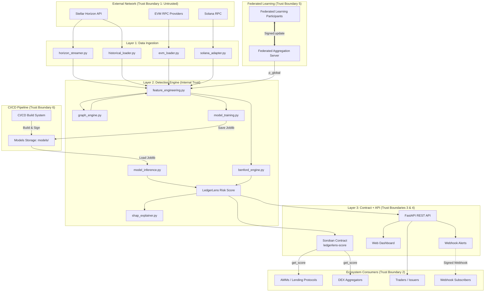

# LedgerLens 🔍

[](https://stellar.org)
[](https://soroban.stellar.org)
[](LICENSE)
[](tests/)

[](https://github.com/Ledger-Lenz/Ledgerlens-core/actions/workflows/ci.yml)
[](https://github.com/Ledger-Lenz/Ledgerlens-core/actions/workflows/docs.yml)
[](https://github.com/Ledger-Lenz/Ledgerlens-core/actions/workflows/chaos.yml)

Hybrid on-chain fraud detection for the Stellar DEX — detecting wash trading and artificial volume using Benford's Law combined with ensemble machine learning, with risk scores anchored on Soroban.

## Table of Contents

- [Repository Layout](#repository-layout)
- [Overview](#overview)
- [Features](#features)
- [Architecture](#architecture)
- [Benford's Law on the Blockchain](#benfords-law-on-the-blockchain)
- [Machine Learning Layer](#machine-learning-layer)
- [Graph-Based Ring Detection](#graph-based-ring-detection)
- [Soroban Smart Contract Layer](#soroban-smart-contract-layer)
- [Repository Structure](#repository-structure)
- [Quick Start](#quick-start)
- [CLI Reference](#cli-reference)
- [Continuous Retraining](#continuous-retraining)
- [Webhook Alerts](#webhook-alerts)
- [Observability](#observability)
- [Testing](#testing)
- [Roadmap](#roadmap)
- [Why This Matters for the Stellar Ecosystem](#why-this-matters-for-the-stellar-ecosystem)
- [Dependencies](#dependencies)
- [License](#license)
- [Contributing](#contributing)
- [LedgerLens Organization](#ledgerlens-organization)
- [Support](#support)
- [References](#references)

## Repository Layout

A quick map of the top-level directories so you can navigate the codebase before diving into any one part:

| Directory / File | Language / Toolchain | Role |
|---|---|---|
| `api/` | Python (FastAPI) | Local read-only REST / GraphQL / gRPC / WebSocket API |
| `detection/` | Python | Benford engine, ML feature engineering, graph ring detection, model training & inference |
| `ingestion/` | Python | Horizon streamer, historical loader, EVM loader, filter pipeline |
| `contracts/` | Rust (Soroban) | On-chain risk-score registry smart contracts |
| `crates/ledgerlens-sdk/` | Rust | Rust client SDK for consuming LedgerLens scores |
| `sdk/` | TypeScript (npm) | TypeScript client SDK |
| `go/` | Go | Go client SDK |
| `helm/` | YAML (Helm) | Kubernetes deployment charts |
| `monitoring/` | YAML / JSON | Prometheus alert rules and Grafana dashboards |
| `chaos-mesh/` | YAML | Chaos engineering experiment definitions |
| `circuits/` | Rust (Circom / Groth16) | ZK-SNARK circuit definitions and trusted-setup artifacts |
| `proto/` | Protobuf | gRPC service definitions |
| `alembic/` | Python | Database migration scripts |
| `tests/` | Python | Test suite (unit, integration, fuzz harnesses) |
| `docs/` | Markdown (MkDocs) | Full documentation site |
| `config/` | Python | Environment-driven configuration (`settings.py`) |
| `scripts/` | Bash / Python | Developer utility scripts |
| `requirements/` | pip-tools | Compiled Python lockfiles (one per install surface) |
| `Cargo.toml` | Rust | Cargo workspace root |
| `go/go.mod` | Go | Go module definition |
| `sdk/package.json` | Node / npm | TypeScript SDK manifest and lockfile |
| `pyproject.toml` | Python | Project metadata and dependency constraints |
| `Makefile` | Make | Developer task shortcuts (`make lint`, `make lock`, …) |

> The production **API**, **dashboard**, and **Soroban contract** live in separate repos — see [LedgerLens Organization](#ledgerlens-organization) for the full picture.

---

## Overview

LedgerLens is a fraud detection system for the Stellar Decentralised Exchange (SDEX). It ingests trade data from the Stellar Horizon API, scores wallets and asset pairs for wash-trading risk using a combination of Benford's Law digit-distribution analysis and ensemble ML classifiers, and publishes those scores both via a public REST API and an on-chain Soroban contract so other protocols can consume them natively.

### The Problem

Wash trading — simultaneously buying and selling the same asset to artificially inflate trading volume — is one of the most pervasive forms of market manipulation in DeFi. Blockchain transparency means every transaction is recorded, but the sheer volume of on-chain activity makes manual detection impossible.

On DEXs, wash trading causes real harm:

- **Traders are misled** into believing an asset has genuine liquidity and market interest when it does not
- **Token issuers manipulate rankings** on DEX aggregators and data platforms by inflating 24-hour volume figures
- **Liquidity providers lose funds** by entering pools that appear active but are dominated by self-dealing activity
- **Ecosystem credibility suffers** — inflated volume metrics on the Stellar DEX undermine confidence from institutional participants, exchanges, and new users

Existing detection approaches are either manual (slow and unscalable) or rely on simple heuristics (easily gamed). No production-grade, open-source wash trading detection system exists for the Stellar DEX — LedgerLens is built to fill that gap.

### What LedgerLens Does

At a high level, it does three things:

- **🔍 Detects** — identifies wallet pairs, trading clusters, and asset pools exhibiting statistically anomalous transaction patterns consistent with wash trading, including circular trade routing, self-matching order behaviour, and artificial volume concentration
- **📊 Scores** — assigns each wallet and each trading pair a **LedgerLens Risk Score (0–100)** based on the combined output of its Benford anomaly metrics and ML classifiers, updating continuously as new ledger data is processed
- **📡 Reports** — exposes risk scores and flagged activity through a public API and lightweight dashboard, making the intelligence accessible to DEX users, protocol teams, wallet providers, and compliance integrators without requiring technical expertise

> 🔒 **Security Model**: LedgerLens incorporates point security controls across webhooks, oracle quorums, model loading, and admin APIs. See the consolidated [STRIDE Threat Model](docs/threat_model.md) for a systematic analysis of trust boundaries.

## Features

- **Benford's Law Anomaly Engine**: Chi-square, per-digit Z-score, and MAD analysis of transaction amounts across rolling time windows (1h, 4h, 24h, 7d, 30d)
- **Ensemble ML Scoring**: Random Forest, XGBoost, and LightGBM classifiers trained on labelled wash-trade patterns with SHAP interpretability
- **Temporal Sequence Model**: LSTM or Transformer encoder that processes a wallet's ordered trade history (up to 200 trades) as a sequence, detecting temporal patterns invisible to aggregate features — regular inter-trade intervals, alternating buy/sell sequences, and burst-pause cycles; fused with the tabular ensemble score via a learned weight `w_seq` (see [docs/temporal_model.md](docs/temporal_model.md))
- **LedgerLens Risk Score (0–100)**: Continuously updated composite score per wallet and per trading pair
- **Cross-Chain Detection**: Links Stellar wallets to EVM counterparts (Ethereum, Base, Polygon) via Allbridge bridge events; detects round-trip wash-trade patterns across chains using six dedicated features (see [docs/cross_chain_detection.md](docs/cross_chain_detection.md))
- **On-Chain Risk Registry**: Soroban smart contract exposes risk scores so AMMs, lending protocols, and aggregators can gate suspicious activity natively
- **Public REST API**: Query scores, recent alerts, and asset risk rankings
- **Lightweight Dashboard**: Web UI for risk-score visibility without requiring technical expertise
- **GNN Ring Detection**: Graph neural network classifier that scores wash-trading ring membership directly from the trade graph, complementing the SCC-based detector (see [docs/gnn_ring_detection.md](docs/gnn_ring_detection.md))
- **Federated Learning**: Privacy-preserving cross-deployment model training with Krum Byzantine-resilient aggregation and differential privacy (see [docs/federated_learning.md](docs/federated_learning.md))

- Adversarial robustness evaluation: attack, certificate, and hardening tools (see docs/adversarial_robustness.md)

## Architecture



### Core Components

- **ingestion/horizon_streamer.py**: Real-time trade data from the Horizon API (SSE / per-ledger polling)
- **ingestion/historical_loader.py**: Bulk historical trade ingestion
- **ingestion/operations_loader.py**: Order-book event ingestion (offer create/update/cancel) from Horizon operations
- **ingestion/account_loader.py**: Account funding-source and creation-time metadata for wallet-graph features
- **ingestion/filters.py**: Configurable filter pipeline — asset pair whitelist/blacklist, minimum volume, asset type, and account exclusion filters with hot-reload and SQLite rejection storage (see [docs/filter-pipeline.md](docs/filter-pipeline.md))
- **ingestion/data_models.py**: Pydantic schemas for trade, asset, and order-book records
- **detection/benford_engine.py**: Benford's Law feature computation (chi-square, Z-score, MAD)
- **detection/graph_engine.py**: Directed trade graph construction, SCC wash-ring discovery, and ring membership indexing
- **detection/feature_engineering.py**: On-chain ML feature extraction
- **detection/risk_score.py**: Shared `RiskScore` schema and Benford+ML score blending
- **detection/model_training.py**: Trains the Random Forest / XGBoost / LightGBM ensemble
- **detection/model_inference.py**: Real-time risk scoring
- **detection/shap_explainer.py**: SHAP-based interpretability layer
- **detection/causal_engine.py**: DoWhy structural causal model — do-calculus interventions, ATE estimation, counterfactual scores
- **detection/embedding_store.py**: SQLite-backed store for GNN wallet embeddings (model version, embedding vector, timestamp)
- **detection/vector_index.py**: FAISS-based approximate nearest neighbor (ANN) index for global similarity search of wallet embeddings

The Soroban contract, REST API, and dashboard live in the
`ledgerlens-contracts`, `ledgerlens-api`, and `ledgerlens-dashboard` repos
respectively — see [LedgerLens Organization](#ledgerlens-organization).

## Benford's Law on the Blockchain

Benford's Law predicts that the leading digit of naturally occurring transaction amounts follows a known, non-uniform distribution (digit 1 ≈ 30.1%, digit 9 ≈ 4.6%). Wash-trading bots tend to use fixed lot sizes or round/algorithmic amounts, producing distributions that diverge from this expectation.

| Metric                            | What it measures                                                                                      |
| --------------------------------- | ----------------------------------------------------------------------------------------------------- |
| **Chi-square statistic**          | Whether the overall digit distribution deviates significantly from Benford's expected distribution    |
| **Chi-square p-value**            | Statistical significance of the chi-square deviation. Uses **Monte Carlo bootstrap** (10,000 multinomial samples) when N < 100 transactions, asymptotic chi-square(df=8) otherwise — see [docs/benford_analysis.md](docs/benford_analysis.md) |
| **`chi_square_pvalue_method`**    | `"bootstrap"` or `"asymptotic"` — logged alongside every flagging decision for audit reproducibility |
| **Z-score (per digit)**           | Whether any individual digit (1–9) appears with significantly higher or lower frequency than expected |
| **Mean Absolute Deviation (MAD)** | Composite divergence measure; values above 0.015 indicate non-conformity                              |

Benford signals alone are insufficient (legitimate market makers can also be non-Benford), so they are combined with the ML layer below.

## Machine Learning Layer

### Feature groups (35 baseline features, see `detection/feature_engineering.FEATURE_NAMES`)

- **Benford features (15)**: Chi-square, Z-score, and MAD across 5 rolling windows (1h, 4h, 24h, 7d, 30d)
- **Trade pattern features (4)**: counterparty concentration ratio, round-trip trade frequency, self-matching rate, order cancellation rate
- **Volume and timing features (4)**: volume-to-unique-counterparty ratio, intra-minute clustering, off-hours activity ratio, volume spike frequency
- **Wallet graph features (7)**: funding source similarity, network centrality within the trading graph, account age, wash-ring membership, largest ring size, cycle volume ratio, and timing tightness score
- **Cross-pair features (5)**: cross-pair activity count, synchrony score, burst overlap ratio, shared wallet cluster size, and volume concentration

## Graph-Based Ring Detection

`detection/graph_engine.py` builds a directed weighted trade graph where nodes are Stellar accounts and edges point from seller/base account to buyer/counter account. Each edge stores aggregate `total_volume` and `trade_count`, and preserves trade timestamps for timing analysis.

Wash-ring discovery uses **iterative Tarjan's SCC algorithm** (`IterativeTarjanSCC`) rather than pairwise thresholds. The iterative implementation uses an explicit work-stack instead of Python recursion, so it handles arbitrarily large graphs without hitting Python's default recursion limit of ~1 000 frames. Any SCC with at least three accounts is treated as a candidate wash ring. For SCCs up to `max_ring_size`, the detector evaluates simple cycles and reports the highest bottleneck cycle volume. Larger SCCs are not enumerated; they are returned as one `truncated=True` descriptor with a conservative `cycle_volume = total_volume * 0.5` estimate so operators still see the risk without risking Johnson-style exponential cycle enumeration.

For graphs exceeding `GRAPH_MMAP_THRESHOLD` nodes (default 50 000), the adjacency list is represented as a `scipy.sparse.csr_matrix` (Compressed Sparse Row), which stores edges contiguously in memory and has lower per-object overhead than a Python dict. The threshold and a hard cap (`MAX_GRAPH_NODES`, default 1 000 000) are configurable via environment variables (see `.env.example`).

Beyond `MAX_GRAPH_NODES`, the pipeline can transparently fall back to an **adaptive sharded graph engine** (`ShardedTradeGraph`) that partitions the graph across multiple workers using community-detection-based sharding (Louvain modularity maximisation), keeping densely-connected wash rings intact within a single shard. Each shard runs `find_wash_rings` independently via a `multiprocessing.Pool` and results are merged with de-duplication. A configurable boundary-overlap buffer replicates accounts near shard boundaries to detect cycles that cross partitions by a small number of hops. See [docs/performance.md#sharded-graph-engine](docs/performance.md#sharded-graph-engine) for accuracy tradeoffs and configuration.

**Scale targets** (single CPU core, measured on synthetic random graphs — see [docs/performance.md](docs/performance.md)):

| Graph size          | Time    | Peak RAM |
| ------------------- | ------- | -------- |
| 10 K nodes, 50 K edges  | < 1 s   | < 25 MB  |
| 100 K nodes, 500 K edges | ~27 s  | ~63 MB   |

The `TradeGraph` class provides an incremental public API (`add_trade`, `find_wash_rings`, `get_ring_members`) that selects the CSR or dict representation automatically based on graph size, and transparently routes to `ShardedTradeGraph` when the node count would exceed `MAX_GRAPH_NODES` (if sharding is enabled).

The four graph-structural ML features are:

| Feature                  | Meaning                                                                     |
| ------------------------ | --------------------------------------------------------------------------- |
| `wash_ring_membership`   | `1.0` when the account belongs to any detected SCC ring, else `0.0`         |
| `wash_ring_size`         | Size of the largest ring containing the account, else `0.0`                 |
| `cycle_volume_ratio`     | Fraction of the account's outgoing volume explained by complete ring cycles |
| `timing_tightness_score` | `1 / (1 + timing_tightness)` for the account's tightest ring, else `0.0`    |

The local API exposes the latest detected rings with `GET /rings`. Each response row includes `accounts`, `total_volume`, `cycle_volume`, and `detected_at`, plus ring metadata such as average trade count, timing tightness, and truncation status.

### Models

| Model             | Role                                                               |
| ----------------- | ------------------------------------------------------------------ |
| **Random Forest** | Stable baseline; handles missing features gracefully               |
| **XGBoost**       | Primary classifier; strongest performance on tabular on-chain data |
| **LightGBM**      | High-speed inference for real-time scoring                         |

Models are trained with **SMOTE** for class imbalance and evaluated with **AUC-ROC**, **Precision-Recall AUC**, and **F1-score**. SHAP values provide per-score interpretability.

### Interpretability: SHAP and Causal Explanations

LedgerLens provides two complementary interpretability layers:

- **SHAP** (`detection/shap_explainer.py`): per-score feature contributions, served via `GET /scores/{wallet}/explain`. SHAP identifies _which_ features were important — but shares credit between correlated features (e.g. Benford signals and ring membership both appear influential even when only one is causal).

- **Causal explanations** (`detection/causal_engine.py`): Average Treatment Effects (ATEs) via do-calculus on a fitted structural causal model, served via `GET /scores/{wallet}/causal-explanation`. This answers the regulatory question _"would this wallet still be flagged if it fixed its Benford distribution?"_ by measuring the independent causal contribution of each feature, separate from correlational effects.

  Key capabilities:
  - `feature_ate_table`: the causal ATE of each feature on `risk_score`
  - `top_causal_features`: top-3 features by absolute ATE (the true causal drivers)
  - `counterfactual_score`: predicted score under a specified feature override (e.g. `wash_ring_membership=0.0`)

  See [docs/causal_inference.md](docs/causal_inference.md) for the full DAG design, do-calculus methodology, and ATE interpretation guide.

## Soroban Smart Contract Layer

The Soroban contract is the on-chain truth layer for LedgerLens risk scores.

### Zero-Knowledge Proof Systems
LedgerLens supports two ZK backends for proving that a score meets a threshold:
- **Pedersen Sigma-Protocol (Default):** Setup-free, verification logic is run directly on-chain. Best for general deployments.
- **Groth16 zk-SNARK (Alternative):** Constant proof size (~256 bytes) and cheap on-chain pairing verification, requiring a trusted setup ceremony. See [docs/zk_snark_range_proof.md](docs/zk_snark_range_proof.md) for design, setup, and key rotation details.

**Fuzzing & Security:** The oracle aggregator and ZK verifier contracts are continuously fuzzed using `cargo-fuzz` to detect integer overflow, authorization bypass, and malformed-input panics. See [docs/contract_fuzzing.md](docs/contract_fuzzing.md) for how to run fuzz targets locally and interpret results. All contract entrypoints are fuzz-tested on every PR (120s per target) and nightly (30min per target) to ensure composability guarantees for downstream AMMs, lending protocols, and aggregators.

### Contract Functions

- `submit_score(signers: Vec<Address>, wallet: Address, asset_pair: Symbol, score: u32, benford_flag: bool, ml_flag: bool, timestamp: u64, confidence: u32, model_version: u32, attestation_input: Option<ScoreAttestationInput>)` - Registers a computed risk score on-chain (authorised LedgerLens service path only)

### Dispute & Governance

LedgerLens includes an off-chain dispute and governance mechanism for managing published scores.

- Submit disputes via `POST /disputes` with an HTTPS `evidence_url` if available.
- Committee members vote to resolve disputes; approved disputes remove the score locally and publish a `score=0` override on-chain.
- Governance proposals allow runtime configuration changes (e.g. `risk_score_threshold`) and committee membership changes.

See `docs/governance_protocol.md` for full details and [docs/threat_model.md](docs/threat_model.md) for the Soroban trust boundary analysis.

- `get_score(wallet: Address, asset_pair: Symbol) -> RiskScore` - Read-only; returns the most recent risk score and timestamp for a wallet/asset pair, callable by any other Soroban contract

```rust
// Simplified Soroban interface (Rust pseudocode)
pub struct RiskScore {
    pub score: u32,          // 0–100; higher = more suspicious
    pub benford_flag: bool,  // True if Benford anomaly detected
    pub ml_flag: bool,       // True if ML classifier flagged
    pub timestamp: u64,      // Ledger timestamp of last update
    pub confidence: u32,     // Model confidence 0–100
}
```

This composability lets AMMs, lending protocols, and DEX aggregators on Stellar query LedgerLens scores natively — for example, gating liquidity provision from wallets above a configurable risk threshold — without an external oracle.

For step-by-step procedures on rotating the service account key and other software-managed credentials, see the [Secret Rotation Runbook](docs/secret_rotation.md).

### Soroban Integration (`detection/soroban_publisher.py`)

After each pipeline run, all `RiskScore` records above `RISK_SCORE_THRESHOLD` are submitted on-chain via `SorobanPublisher.submit_batch()`. This transforms LedgerLens from a standalone detection tool into composable on-chain financial infrastructure.

**Configuration** (see `.env.example` for defaults):

| Variable                            | Purpose                                                                             |
| ----------------------------------- | ----------------------------------------------------------------------------------- |
| `LEDGERLENS_SCORE_CONTRACT_ID`      | Soroban contract ID of the deployed `ledgerlens-score` contract                     |
| `LEDGERLENS_SERVICE_SECRET_KEY`     | **Secret**: Stellar account key authorized to call `submit_score()` on the contract |
| `SOROBAN_RPC_URL`                   | Soroban RPC endpoint (separate from Horizon; defaults to Testnet)                   |
| `NETWORK_PASSPHRASE`                | Stellar network passphrase (must match the network the contract is on)              |
| `SOROBAN_CIRCUIT_BREAKER_THRESHOLD` | Consecutive failures before the circuit opens (default: 5)                          |
| `SOROBAN_CIRCUIT_RESET_SECONDS`     | Seconds until the circuit resets (default: 300)                                     |

#### EVM Multi-Provider Configuration

| Variable                          | Default  | Purpose                                                                                      |
| --------------------------------- | -------- | -------------------------------------------------------------------------------------------- |
| `EVM_PROVIDERS`                   | `[]`     | JSON array of provider objects for multi-chain failover (see format below)                   |
| `EVM_MAX_BLOCK_LAG`               | `10`     | Blocks behind chain head before a provider's health score is penalised; triggers lag alerts when _all_ providers exceed this on a chain |
| `EVM_PROBE_INTERVAL_SECONDS`      | `15.0`   | Seconds between `eth_blockNumber` health probe cycles                                        |
| `EVM_CIRCUIT_BREAKER_THRESHOLD`   | `5`      | Consecutive failures before a provider's circuit opens and it is skipped                     |

`EVM_PROVIDERS` format — a JSON array where each entry must have `chain_id` (int), `rpc_url` (**https:// only**), and `name` (string). Optional fields: `priority` (int, lower = tried first; default 0) and `max_requests_per_second` (float; default 10.0).

```bash
EVM_PROVIDERS=[
  {"chain_id": 1, "rpc_url": "https://mainnet.infura.io/v3/YOUR_KEY", "name": "infura", "priority": 0},
  {"chain_id": 1, "rpc_url": "https://eth-mainnet.alchemyapi.io/v2/YOUR_KEY", "name": "alchemy", "priority": 1},
  {"chain_id": 8453, "rpc_url": "https://base-mainnet.infura.io/v3/YOUR_KEY", "name": "infura-base", "priority": 0},
  {"chain_id": 137, "rpc_url": "https://polygon-mainnet.infura.io/v3/YOUR_KEY", "name": "infura-polygon", "priority": 0}
]
```

> **Security**: `rpc_url` must use `https://` — `http://` endpoints transmit API keys in plaintext and are rejected at startup with a `ValueError`. API keys embedded in URLs (e.g. `infura.io/v3/SECRET`) are masked in all log output and never appear in error messages. When `EVM_PROVIDERS` is empty (`[]`), the pool falls back to the legacy `EVM_RPC_ETHEREUM` / `EVM_RPC_BASE` / `EVM_RPC_POLYGON` single-endpoint settings.

**Transaction lifecycle**:

1. **Build** — create an `InvokeContractFunction` operation for `submit_score(wallet, asset_pair, score, timestamp)`
2. **Simulate** — call `simulate_transaction` to obtain the resource fee
3. **Sign** — sign with the service account keypair (in-process; the key never leaves the machine)
4. **Submit** — `send_transaction` with the signed transaction
5. **Poll** — `get_transaction` every 1 second until `SUCCESS` or `FAILED`

**Error handling & retry logic**:

- `tx_bad_seq` — refresh the account sequence number and retry once
- `INSUFFICIENT_FEE` — multiply the fee by 1.5 and retry once
- Soroban `auth_failed` — log `ERROR` and raise `SorobanSubmissionError` immediately (do not retry — the service key is misconfigured)
- All other errors — log `WARNING`, record the failure, and include the error in the `submit_batch` results dict

**Circuit breaker**: after `SOROBAN_CIRCUIT_BREAKER_THRESHOLD` consecutive failures within a 60-second rolling window, the publisher stops calling the contract and raises `SorobanCircuitOpenError`. The circuit auto-resets after `SOROBAN_CIRCUIT_RESET_SECONDS`. This prevents submission storms on contract failures without blocking the pipeline.

**Security**:

- `LEDGERLENS_SERVICE_SECRET_KEY` is converted to a `Keypair` at construction time; the raw key string is not retained as an instance variable
- The keypair object's secret is never included in `__repr__`, logs, or the `on_chain_submissions` audit table
- The publisher overrides `__getstate__` to exclude the keypair from pickle serialization
- Running with `--no-submit` (via `cli.py score --no-submit`) skips all on-chain calls

**Audit log**: every submission attempt (success, failure, or skip) is written to the `on_chain_submissions` table in the local SQLite store. The table records wallet, asset pair, score, transaction hash (if available), status, error message, and timestamp.

## Repository Structure

This repository (`ledgerlens-core`) contains only the detection engine. The
API, dashboard, and Soroban contract live in separate repos — see
[LedgerLens Organization](#ledgerlens-organization) below.

```
ledgerlens-core/
│
├── README.md                         ← This file
├── requirements.txt                  ← Python dependencies
├── pyproject.toml                    ← Project metadata, pytest config
├── .env.example                      ← Configuration template (incl. cross-repo keys)
├── run_pipeline.py                   ← Full detection pipeline entry point
├── cli.py                            ← `ledgerlens` CLI (generate-data, train, score, serve)
├── Dockerfile / docker-compose.yml   ← Containerized local API
│
├── config/
│   └── settings.py                   ← Environment-driven configuration
│
├── ingestion/
│   ├── horizon_streamer.py           ← Real-time trade data from Horizon API
│   ├── historical_loader.py          ← Bulk historical trade ingestion
│   ├── operations_loader.py          ← Order-book event ingestion (offer ops)
│   ├── account_loader.py             ← Account funding-source / creation-time metadata
│   ├── filters.py                    ← Configurable trade filter pipeline (whitelist/blacklist/volume/type/exclusion)
│   ├── synthetic_data.py             ← Synthetic trade/wash-ring generator for local training
│   ├── http_client.py                ← Retrying HTTP helper for Horizon calls
│   └── data_models.py                ← Pydantic schemas for trade/asset/order-book records
│
├── detection/
│   ├── benford_engine.py             ← Benford's Law feature computation
│   ├── graph_engine.py               ← Directed trade graph and SCC ring detection
│   ├── feature_engineering.py        ← On-chain ML feature extraction
│   ├── dataset.py                    ← Labelled feature dataset builder (training)
│   ├── model_training.py             ← Train ensemble classifiers
│   ├── model_inference.py            ← Real-time risk scoring
│   ├── shap_explainer.py             ← SHAP interpretability layer
│   ├── risk_score.py                 ← Shared `RiskScore` schema + scoring logic
│   └── storage.py                    ← SQLite-backed local RiskScore store
│
├── api/
│   └── main.py                       ← Local read-only FastAPI app serving RiskScores
│
├── sdk/                              ← TypeScript client SDK (@ledgerlens/sdk) — see sdk/README.md
│
└── tests/
    └── ...
```

### Client SDKs

Typed client libraries for the LedgerLens API live in this repo and cover the
same REST surface in four languages:

| Language | Package | Location | Docs |
|----------|---------|----------|------|
| TypeScript | `@ledgerlens/sdk` | [`sdk/`](sdk/) | [sdk/README.md](sdk/README.md) |
| Python | `ledgerlens-sdk` | [`packages/ledgerlens-sdk/`](packages/ledgerlens-sdk/) | [packages/ledgerlens-sdk/README.md](packages/ledgerlens-sdk/README.md) |
| Go | `github.com/Ledger-Lenz/Ledgerlens-core/go` | [`go/`](go/) | [go/README.md](go/README.md) |
| Rust | `ledgerlens-sdk` | [`crates/ledgerlens-sdk/`](crates/ledgerlens-sdk/) | [crates/ledgerlens-sdk/README.md](crates/ledgerlens-sdk/README.md) |

## Quick Start

### 1. Install dependencies

```bash
pip install -r requirements.txt
```

### 2. Configure environment

```bash
cp .env.example .env
```

Fill in the Horizon, model, and cross-repo settings described in
[LedgerLens Organization](#ledgerlens-organization).

## Troubleshooting

### Missing or misconfigured `.env`

**Symptom:** startup fails with a config error, empty values, or missing required
environment variables.

**Fix:** copy the template and verify the values you actually need for your setup:

```bash
cp .env.example .env
grep -E '^(REDIS_URL|LEDGERLENS_DB_PATH|NETWORK|HORIZON_URL|LEDGERLENS_API_URL)=' .env
```

If a value is blank, wrong, or pointing to a non-existent file/host, update it in
`.env` before running the pipeline. See [.env.example](.env.example) and the
configuration code in [`config/settings.py`](config/settings.py) for the full list.

### Redis is not running

**Symptom:** feature-store or rate-limiter errors like `Connection refused`,
`redis.exceptions.ConnectionError`, or slow/failing requests after startup.

**Fix:** start Redis locally or via Docker, then confirm the URL matches your `.env`:

```bash
docker compose up -d redis
# or, if running Redis directly:
redis-server --daemonize yes
```

Check that `REDIS_URL` in your `.env` matches the service you actually started,
for example `redis://localhost:6379/0`. See [docs/feature_store.md](docs/feature_store.md)
and [docs/waf_and_rate_limiting.md](docs/waf_and_rate_limiting.md) for the deeper
feature-store and rate-limiter notes.

### Port already in use

**Symptom:** the API or watchdog fails at startup with `address already in use`
or a bind error on `localhost:8000`.

**Fix:** stop the process currently listening on the port or choose another port:

```bash
lsof -i :8000
kill <PID>
# or run the API on a different port if needed
```

If you are using Docker Compose, check which service is bound to the port and
restart only the conflicting container. See [docker-compose.yml](docker-compose.yml)
for the default local port mapping.

### `ledgerlens.db` is missing on first run

**Symptom:** SQLite errors such as `unable to open database file`, or the app
reports that the database path is not writable.

**Fix:** ensure the path in `LEDGERLENS_DB_PATH` points to a writable location,
then create or reset the file if needed:

```bash
mkdir -p .
touch ledgerlens.db
chmod 600 ledgerlens.db
```

The default is `./ledgerlens.db`, relative to the project root. If you override it,
make sure the directory exists and is writable. See [docs/database_migrations.md](docs/database_migrations.md)
and [docs/database_schema.md](docs/database_schema.md) for how the SQLite store
is resolved and used.

### 2a. Configure trade filters (optional)

```bash
cp config/filter_config.yaml.example config/filter_config.yaml
```

Edit `config/filter_config.yaml` to enable asset pair whitelists/blacklists,
minimum volume thresholds, and account exclusion lists. See
[docs/filter-pipeline.md](docs/filter-pipeline.md) for full documentation.
All filters default to `enabled: false` (pass-through) so the pipeline works
out of the box without any filter configuration.

### 3. Train on synthetic data

No labelled dataset from `ledgerlens-data` is required to get started —
`cli.py train` generates a synthetic trade history with labelled
wash-trading rings (`ingestion/synthetic_data.py`) and trains the
RF/XGBoost/LightGBM ensemble on it:

```bash
python cli.py train
```

### 4. Run the detection pipeline

```bash
python run_pipeline.py
```

This scores each wallet/asset-pair combination and writes the resulting
`RiskScore` records to the local SQLite store (`LEDGERLENS_DB_PATH`).

### 5. Serve the local API

```bash
python cli.py serve --reload
```

Exposes `/health`, `/scores`, `/scores/{wallet}`, `/scores/{wallet}/explain`,
`/alerts`, `/assets/risk-ranking`, `/correlations`, and `/rings` over the
locally stored `RiskScore` records — a stand-in for `ledgerlens-api` during
local development.

#### Prometheus metrics

The local API exposes a Prometheus-compatible metrics endpoint at `GET /metrics`
(configurable via `METRICS_ENDPOINT`). It returns the standard text exposition
format from `prometheus_client.generate_latest()`.

```bash
# Requires X-LedgerLens-Admin-Key when LEDGERLENS_ADMIN_API_KEY is set
curl -H "X-LedgerLens-Admin-Key: your-admin-key" http://localhost:8000/metrics
```

All LedgerLens metric names are prefixed with `ledgerlens_`. See
[docs/metrics.md](docs/metrics.md) for the full metric catalogue, label
descriptions, and recommended alert thresholds.

> **Security**: if `LEDGERLENS_ADMIN_API_KEY` is unset, `/metrics` is publicly
> accessible and a WARNING is logged at startup. Always set an admin key in
> production deployments to prevent operational data leakage.

##### SHAP Explanation Endpoint

```bash
# Get waterfall-style SHAP explanation (requires admin key)
curl -H "X-LedgerLens-Admin-Key: your-admin-key" \
  "http://localhost:8000/v1/scores/GABCD...XYZ/explain?asset_pair=XLM/USDC&model=random_forest"
```

Response returns base value, ranked feature contributions, and a
human-readable summary sentence. Supports `model` query parameter:
`random_forest` (default), `xgboost`, `lightgbm`. See
[docs/shap_explanation.md](docs/shap_explanation.md) for the full caching
strategy and TTL.

#### Authentication (Gateway Middleware)

All authenticated routes go through the consolidated **API Gateway**
(`api/gateway.py`), which resolves auth, enforces quota, and logs every
request in one pass. See [`docs/api_gateway.md`](docs/api_gateway.md) for
the full architecture and migration guide.

Authentication is resolved via (in order):
1. `X-LedgerLens-Admin-Key` — matched against `LEDGERLENS_ADMIN_API_KEY`
2. `X-LedgerLens-Compliance-Key` — matched against `LEDGERLENS_COMPLIANCE_API_KEY`
3. `X-LedgerLens-Api-Key` — looked up in the canonical `api_keys` table

#### CORS configuration

The local API defaults to **deny-all** CORS (no browser origins are allowed
unless explicitly configured). Set `LEDGERLENS_CORS_ALLOWED_ORIGINS` in your
`.env` to a comma-separated list of permitted origins:

```bash
# Allow the dashboard dev server
LEDGERLENS_CORS_ALLOWED_ORIGINS=http://localhost:3000

# Allow multiple origins (e.g. staging + production dashboard)
LEDGERLENS_CORS_ALLOWED_ORIGINS=https://dashboard.ledgerlens.io,https://staging.ledgerlens.io
```

> **Security**: never set `LEDGERLENS_CORS_ALLOWED_ORIGINS=*`. The API rejects
> a wildcard at startup with a `ValueError`. Combining `allow_origins=["*"]`
> with `allow_credentials=True` would let any website read authenticated
> responses — a well-known OWASP A05:2021 misconfiguration. The setting enforces
> an explicit origin list to prevent this from ever reaching production.

#### `/health` response contract

`GET /health` performs two real checks on every call:

| Component | Check                                                               | OK value |
| --------- | ------------------------------------------------------------------- | -------- |
| `db`      | Executes `SELECT 1` via the existing SQLite connection              | `"ok"`   |
| `models`  | Each model `.joblib` file exists under `MODEL_DIR` and has size > 0 | `"ok"`   |

Returns **HTTP 200** when both pass:

```json
{ "status": "ok", "db": "ok", "models": "ok" }
```

Returns **HTTP 503** when any check fails, naming the failing component:

```json
{"status": "degraded", "db": "error: database unreachable", "models": "ok"}
{"status": "degraded", "db": "ok", "models": "missing: random_forest, xgboost"}
```

The response body never contains raw filesystem paths or exception text —
errors are logged server-side at `ERROR` level via `logger.exception`.

> The production API, dashboard, and Soroban contract live in their
> respective repos (`ledgerlens-api`, `ledgerlens-dashboard`,
> `ledgerlens-contracts`).

### Docker

```bash
docker compose up --build
```

For evidence-based fixes to Python, Rust, Go, TypeScript, database, Redis, and
first-run test problems, see the detailed [troubleshooting guide](docs/troubleshooting.md).

## CLI Reference

```bash
python cli.py generate-data   # write synthetic trades/labels to CSV
python cli.py generate-adversarial --strategy benford_camouflage \
  --n-wallets 200 --n-trades 1000
                              # write adversarial feature CSV (label=1 for wash)
                              #   --label-wash/--label-clean  mark wash or zero all labels
                              #   strategies: benford_camouflage | timing_jitter |
                              #               graph_fragmentation | cross_pair_rotation
python cli.py train           # train the ensemble on synthetic data
python cli.py score           # run the pipeline against live Horizon data
python cli.py historical-load --start 2026-05-01T00:00:00Z --end 2026-05-31T00:00:00Z \
  --concurrency 8 --chunk-hours 6 --resume
                              # parallel, restart-safe Horizon trade backfill
python cli.py stream          # stream trades from Horizon SSE and score incrementally
                              #   --checkpoint-interval N  persist state every N trades (default: 100)
                              #   --score-delta N          min score change to emit alert (default: 5)
                              #   --queue-depth N          cap buffered trades (default: 1000)
                              #   --overflow-strategy S    block, drop_newest, or drop_oldest
                              #   --reset-cursor           discard the saved Horizon position
python cli.py retrain-check   # check for distribution drift and retrain if needed
python cli.py compute-embeddings --window-days 30  # compute and store GNN embeddings for all wallets in the last 30 days
python cli.py serve           # serve the local API
python cli.py grpc-serve      # run the gRPC Internal Scoring Service sidecar
python cli.py webhook-worker  # run the webhook delivery worker
python cli.py db-migrate      # apply any pending SQLite schema migrations
```

The Horizon stream position is stored atomically in
`CURSOR_CHECKPOINT_PATH` (default `./data/horizon_cursor.json`). The path must
remain inside `DATA_DIR`. Use `--reset-cursor` when an intentional fresh start
or replay is required.

## Continuous Retraining

LedgerLens models are trained once on synthetic data, but in production, wash-trading strategies evolve — bots adapt their lot sizes, timing patterns, and circular routing to evade detection. Without detecting and responding to this **concept drift**, model performance silently degrades over time.

The continuous retraining pipeline automatically monitors the distribution of features in production scoring and triggers retraining when drift is detected, with safe rollback to the previous model if the new model underperforms.

### Drift Detection Methodology

Drift is detected using the **Population Stability Index (PSI)**, a statistical measure of how much a feature distribution has shifted between training and production:

$$\text{PSI} = \sum_{i=1}^{n} \left( \text{current}_i - \text{training}_i \right) \times \ln\left(\frac{\text{current}_i}{\text{training}_i}\right)$$

**PSI Interpretation:**

- **PSI = 0**: Distributions are identical
- **0 < PSI < 0.10**: Negligible drift; no action needed
- **0.10 ≤ PSI < 0.20**: Small drift; monitor closely
- **PSI ≥ 0.20**: Significant drift; retraining recommended
- **PSI > 0.25**: Severe drift; retraining strongly advised

Drift is declared when **at least 3 features** exceed PSI threshold (default 0.20). This threshold minimizes false positives from natural market dynamics while capturing genuine performance-degrading drift.

### Running Drift Checks

After the pipeline records scored features (automatic on each `python cli.py score` run), trigger a drift check and potential retrain:

```bash
python cli.py retrain-check
```

**Options:**

- `--psi-threshold 0.20`: PSI threshold for marking a feature as drifted (default 0.20)
- `--min-drifted-features 3`: Minimum number of drifted features to trigger retraining (default 3)
- `--force-retrain`: Force retraining even if no drift detected (useful for manual updates)

**What happens:**

1. Computes PSI for all features, comparing production data (last 30 days) against training reference
2. If drift detected (or force-retrain enabled), trains a new ensemble on the original training distribution (synthetic data)
3. Compares new models' AUC-ROC scores against previous models
4. **Promotes** new models only if AUC-ROC ≥ previous version (safer rollout)
5. **Reverts** to previous version if new models underperform
6. Writes a drift report to `./drift_reports/YYYYMMDD_HHMM.json` with PSI values and promotion decision

### Model Versioning and Rollback

Each trained model is stored with a version hash (SHA-256[:8] of training data fingerprint + timestamp):

```
models/
├── random_forest_v12a3b4c5.joblib      # Versioned model
├── random_forest_latest.txt              # Points to current version
├── xgboost_v12a3b4c5.joblib
├── xgboost_latest.txt
├── lightgbm_v12a3b4c5.joblib
├── lightgbm_latest.txt
├── training_reference.csv                # Reference dataset for drift detection
└── training_metadata.json                # Training metadata, AUC-ROC scores, etc.
```

If a newly promoted model degrades performance, rollback is automatic:

```bash
# Manual rollback (if needed):
# Edit random_forest_latest.txt, xgboost_latest.txt, lightgbm_latest.txt
# to point to a previous version (e.g., 12a3b4c5)
```

### Feature Distribution Tracking

Every time the scoring pipeline runs, feature vectors are persisted to SQLite for drift monitoring:

```sql
CREATE TABLE feature_distribution_snapshots (
    id INTEGER PRIMARY KEY,
    wallet TEXT,
    asset_pair TEXT,
    feature_name TEXT,
    feature_value REAL,
    recorded_at TIMESTAMP
);
```

**Storage budget**: At 1,000 wallets/run × 4 runs/day × 30 days × 26 features × ~8 bytes/float ≈ 25 MB for 30 days of history in the hot tier.

LedgerLens uses a **two-tier archival pipeline** to retain full history beyond 30 days without unbounded SQLite growth:

- **Hot tier (SQLite)**: recent snapshots (< `FEATURE_ARCHIVE_CUTOFF_DAYS`, default 30 days), optimised for fast writes and ad-hoc queries.
- **Cold tier (Parquet)**: archived snapshots (≥ cutoff), stored as columnar Parquet files under `FEATURE_ARCHIVE_DIR`, partitioned by date (`YYYY/MM/DD`).

Archival runs automatically at the start of each `retrain-check`, or manually via `python cli.py archive-features`. The `DualTierFeatureStore` class provides a unified query interface across both tiers — drift analysis code never needs to know which tier holds a particular record. See [docs/feature_store_archival.md](docs/feature_store_archival.md) for the full architecture and recovery procedure.

### Scheduling Retrain Checks

For production deployments, schedule retrain checks via cron or systemd timer:

**Cron example (daily at 2 AM):**

```cron
0 2 * * * cd /path/to/ledgerlens-core && python cli.py retrain-check >> /var/log/ledgerlens-retrain.log 2>&1
```

**Systemd timer example:**

`/etc/systemd/system/ledgerlens-retrain.service`

```ini
[Unit]
Description=LedgerLens Continuous Retrain Check
After=network.target

[Service]
Type=oneshot
WorkingDirectory=/path/to/ledgerlens-core
ExecStart=/usr/bin/python cli.py retrain-check
StandardOutput=journal
StandardError=journal
```

`/etc/systemd/system/ledgerlens-retrain.timer`

```ini
[Unit]
Description=Daily LedgerLens Retrain Check

[Timer]
OnCalendar=daily
OnCalendar=*-*-* 02:00:00
Persistent=true

[Install]
WantedBy=timers.target
```

Enable and start:

```bash
systemctl enable ledgerlens-retrain.timer
systemctl start ledgerlens-retrain.timer
```

### Monitoring and Alerts

Inspect drift reports to monitor model stability:

```bash
ls -lh ./drift_reports/
# Example output:
# 20260615_0200.json: {"drift_detected": true, "promoted": true, ...}
# 20260614_0200.json: {"drift_detected": false, "promoted": false, ...}
```

**Alert on failures**: If `promoted: false` but `drift_detected: true`, the new models failed to outperform the current ones. Investigate feature shifts in the drift report's `psi_report` field and consider:

- Expanding the training dataset with recent adversarial examples
- Adjusting feature engineering (e.g., new adversarial or graph features)
- Lowering the PSI threshold if the drift is natural (market regime change) rather than evasion

### Model Observability API

Every `cli.py retrain-check` run also persists its drift report and per-model retrain outcome to SQLite, queryable over HTTP instead of grepping `./drift_reports/`:

| Method | Endpoint               | Description                                                                                                     |
| ------ | ---------------------- | --------------------------------------------------------------------------------------------------------------- |
| `GET`  | `/admin/drift-reports` | Most recent drift checks (PSI report, threshold, detected flag)                                                 |
| `GET`  | `/admin/retrain-runs`  | Most recent per-model retrain outcomes (old/new version, AUC-ROC, promoted, forced); filter with `?model_name=` |

Both endpoints require an admin key, since they expose internal model governance data. Set `LEDGERLENS_ADMIN_API_KEY` and pass it via the `X-LedgerLens-Admin-Key` header:

```bash
export LEDGERLENS_ADMIN_API_KEY="$(openssl rand -hex 32)"
curl -H "X-LedgerLens-Admin-Key: $LEDGERLENS_ADMIN_API_KEY" http://localhost:8000/admin/retrain-runs?model_name=random_forest
```

If `LEDGERLENS_ADMIN_API_KEY` is unset, both endpoints return `503` rather than allowing unauthenticated access.

## Webhook Alerts

LedgerLens can push risk-score alerts to subscriber URLs via webhooks.
When the detection pipeline (`run_pipeline.py`) produces scores above a
subscriber's threshold, a signed payload is POSTed to their endpoint.

### Subscriber Registration

Register a webhook subscriber via the API:

```bash
curl -X POST http://localhost:8000/webhooks \
  -H "Content-Type: application/json" \
  -d '{
    "url": "https://my-protocol.xyz/webhook",
    "secret": "whsec_your_hmac_secret",
    "min_score": 70
  }'
```

Optional filters restrict alerts by wallet or asset pair:

```json
{
  "url": "https://my-protocol.xyz/webhook",
  "secret": "whsec_your_hmac_secret",
  "min_score": 80,
  "wallet_filter": "GABC123,GDEF456",
  "asset_pair_filter": "XLM/USDC"
}
```

The response returns a `subscriber_id` (UUID) used for management.

### Management Endpoints

| Method   | Path                        | Description                        |
| -------- | --------------------------- | ---------------------------------- |
| `POST`   | `/webhooks`                 | Register a subscriber              |
| `GET`    | `/webhooks`                 | List active subscribers            |
| `DELETE` | `/webhooks/{subscriber_id}` | Deactivate a subscriber            |
| `GET`    | `/webhooks/dead-letters`    | List permanently failed deliveries |

### Analyst Feedback Endpoints

| Method | Path                | Description                                         |
| ------ | ------------------- | --------------------------------------------------- |
| `POST` | `/v1/feedback`      | Submit analyst label correction (admin-key required) |
| `GET`  | `/v1/feedback`      | Paginated correction history (admin-key required)    |

### Analyst Review Dashboard & Case Management

| Method | Path                                       | Description                                              |
| ------ | ------------------------------------------ | -------------------------------------------------------- |
| `GET`  | `/analyst/queue`                           | Top 20 wallets awaiting review (with assignment state)   |
| `GET`  | `/analyst/wallet/{wallet}`                 | Combined review view (score, SHAP, timeline, rings)      |
| `POST` | `/analyst/wallet/{wallet}/claim`           | Claim a wallet for review (soft lock, 30 min)            |
| `POST` | `/analyst/wallet/{wallet}/release`         | Release a claim before verdict                           |
| `POST` | `/analyst/wallet/{wallet}/feedback`        | Submit verdict (requires active claim)                   |
| `GET`  | `/analyst/stats`                           | Aggregate review statistics                              |
| `GET`  | `/analyst/case-stats`                      | SLA metrics (claim/resolution times, queue depth)        |
| `GET`  | `/analyst/feedback`                        | Export feedback for active learning loop                 |

### Cross-Chain Link Endpoints

| Method | Path                                          | Description                                                |
| ------ | --------------------------------------------- | ---------------------------------------------------------- |
| `GET`  | `/cross-chain/links/{stellar_wallet}`         | Accepted Bayesian link hypotheses (sorted by confidence)   |
| `GET`  | `/cross-chain/links/{stellar_wallet}/explain` | Evidence feature breakdown per hypothesis (admin-key only) |

### Payload Format

Every webhook POST carries this JSON body:

```json
{
  "event": "risk_score_alert",
  "data": {
    "wallet": "GABCDEF123...",
    "asset_pair": "XLM/USDC",
    "score": 85,
    "benford_flag": true,
    "ml_flag": true,
    "confidence": 90,
    "timestamp": "2026-06-16T12:00:00Z"
  },
  "timestamp": "2026-06-16T12:00:05Z"
}
```

### HMAC Verification

Each request includes a `X-LedgerLens-Signature` header:

```
X-LedgerLens-Signature: sha256=<hex-digest>
```

The digest is an HMAC-SHA256 of the raw request body using the
subscriber's `secret`. Receivers **must** verify this signature before
trusting the payload. Example verification in Python:

```python
import hmac, hashlib

def verify_ledgerlens_webhook(body: bytes, secret: str, signature: str) -> bool:
    expected = "sha256=" + hmac.new(
        secret.encode(), body, hashlib.sha256
    ).hexdigest()
    return hmac.compare_digest(signature, expected)
```

The `X-LedgerLens-Timestamp` header contains the Unix epoch second when
the delivery was attempted. Receivers SHOULD reject timestamps older than
5 minutes to prevent replay attacks.

### Delivery Guarantees

- **At-least-once delivery**: unacknowledged items stay `pending` in the
  queue and are retried on worker restart.
- **Exponential backoff**: attempt N is retried at `now + 2^N × 5s`
  (capped at 1 hour).
- **Dead-letter queue**: after 8 consecutive failures the item moves to
  `dead` status. Inspect via `GET /webhooks/dead-letters`.
- **Concurrency limit**: at most 10 deliveries run in parallel; slow
  subscribers do not block others.

### Running the Delivery Worker

```bash
python cli.py webhook-worker --interval 5
```

This polls the delivery queue every 5 seconds and delivers due webhooks.
Run as a long-lived foreground process (e.g., under systemd or supervisor).

### Security Notes

- Subscriber URLs must use `https://`. HTTP URLs and private/reserved IPs
  are rejected at registration (SSRF protection).
- HMAC secrets are encrypted at rest with AES-256-GCM. The encryption key
  is loaded from `LEDGERLENS_WEBHOOK_ENCRYPTION_KEY` (32-byte base64,
  stored in the environment **only**).
- Raw secrets never appear in API responses, logs, or error messages.
- The response body from the webhook receiver is discarded entirely to
  prevent log injection.

## Observability

LedgerLens ships a production-grade observability stack. See [docs/observability.md](docs/observability.md) for full details and [docs/threat_model.md](docs/threat_model.md) for the STRIDE threat model.

- **Structured JSON logging** — every log record is valid JSON with `timestamp`, `level`, `correlation_id`, and `trace_id` fields (via [structlog](https://www.structlog.org/))
- **Correlation IDs** — each pipeline pass and API request is assigned a UUID4 that threads through all log lines and spans; the `X-Correlation-ID` header is propagated in API responses
- **OpenTelemetry tracing** — spans for `pipeline.run`, `model.score_batch`, `soroban.submit_score`, and `webhook.deliver`; FastAPI routes are auto-instrumented; export via OTLP gRPC or console fallback
- **OpenLineage tracking** — START/COMPLETE/FAIL events at ingestion, feature engineering, and model training stages; supports Marquez backend and a built-in admin-only REST API (see [docs/lineage.md](docs/lineage.md))
- **Prometheus metrics** — 10 metrics covering scoring throughput, latency, Soroban submissions, circuit breaker state, webhook delivery health, drift events, and model AUC-ROC; scraped at `GET /metrics`
- **Alerting rules** — 5 Prometheus alert rules in `monitoring/alerts.yml` for circuit-breaker open, dead-letter backlog, feature drift, high scoring latency, and pipeline stall
- **Wallet masking** — Stellar wallet addresses are truncated to `GABC1234...WXYZ` in all log output; no PII in metric labels

## Testing

```bash
pytest
```

Covers:

- ✅ Benford's Law feature computation
- ✅ ML feature engineering (trade pattern, volume/timing, graph-ring features)
- ✅ Graph-based wash-ring discovery and ring storage
- ✅ Synthetic data generation and labelled dataset building
- ✅ RiskScore combination logic and SQLite storage
- ✅ Local API and CLI
- ✅ Horizon HTTP retry/backoff behaviour
- ✅ Fuzz-tested ingestion parsers (Atheris coverage-guided harnesses in `fuzz/`; see [docs/testing_guide.md](docs/testing_guide.md))

## Roadmap

### Phase 1 — Foundation _(Months 1–2)_

- [x] Stellar Horizon API ingestion pipeline (historical + streaming)
- [x] Benford's Law engine for on-chain transaction amounts
- [x] Initial feature engineering from SDEX trade data
- [x] Baseline ML model training on synthetic wash trade patterns
- [ ] Internal testing on Stellar Testnet

### Phase 2 — Core Product _(Months 3–4)_

- [x] Full ensemble model training and evaluation
- [x] SHAP interpretability integration
- [ ] Soroban smart contract deployment on Testnet
- [x] Local REST API (v1, read-only) — see `api/main.py`
- [ ] Public REST API with rate limiting (`ledgerlens-api`)
- [ ] Web dashboard (beta)

### Phase 3 — Ecosystem Integration _(Months 5–6)_

- [ ] Mainnet deployment
- [x] SDK for protocol integrations (Python, TypeScript, Go, Rust)
- [ ] Webhook alert system for asset issuers and protocol teams
- [ ] Open dataset release: labelled SDEX wash trade patterns
- [ ] Community feedback and model refinement cycle

### Phase 4 — Scale _(Post-Grant)_

- [ ] Continuous model retraining pipeline
- [ ] Coverage expansion to AMM pools and cross-asset paths
- [ ] Integration partnerships with Stellar DEX aggregators
- [ ] Developer documentation portal

## Why This Matters for the Stellar Ecosystem

A DEX where volume figures can't be trusted is one that institutional participants and serious traders avoid. LedgerLens addresses this directly:

- **For traders** — Risk scores show which assets have genuine liquidity, without requiring on-chain expertise
- **For asset issuers** — A low risk score is a credibility signal for listings and investor materials
- **For protocol teams** — Integrate LedgerLens scores into AMM/lending contract logic to protect users from wash-traded assets
- **For the Stellar Foundation and ecosystem** — An open, verifiable, community-maintained fraud detection layer strengthens Stellar's case as trustworthy financial infrastructure

LedgerLens is an **open-source public good** — methodology, scores, and training data are transparent and auditable, and the project will always be free to query.

## Dependencies

- Python 3.10+ (`requirements.txt`)
- `soroban-sdk` — for the on-chain risk registry contract
- FastAPI, scikit-learn, XGBoost, LightGBM, SHAP

## License

MIT

## Contributing

LedgerLens is being developed as an open-source contribution to the Stellar ecosystem, submitted as part of the **Drip Wave builder programme**. We are actively looking for collaborators with experience in:

- Stellar / Soroban smart contract development (Rust)
- Python backend development and ML pipeline engineering
- On-chain data analysis and blockchain forensics
- Frontend development (dashboard)
- DeFi protocol integration

Quick checklist for contributions:

- All tests pass: `pytest`
- Code follows project style guidelines
- New features include tests
- Documentation is updated

## LedgerLens Organization

This repo is one of six in the LedgerLens organization. If a change here
touches a shared contract (below), call it out so the matching repo can be
updated.

| Repo                                | Role                                                                                                                                                                                   | Primary language   |
| ----------------------------------- | -------------------------------------------------------------------------------------------------------------------------------------------------------------------------------------- | ------------------ |
| **`.github`**                       | Org-wide GitHub config: shared workflows, issue/PR templates, CODEOWNERS, reusable CI actions                                                                                          | YAML               |
| **`ledgerlens-data`**               | Canonical storage for raw + processed trade data and labelled training datasets used by `core` for model training                                                                      | SQL / Python       |
| **`ledgerlens-core`** _(this repo)_ | Detection engine: Horizon ingestion, Benford's Law analysis, ML feature engineering, ensemble training/inference, SHAP explanations, `RiskScore` computation                           | Python             |
| **`ledgerlens-api`**                | Public REST API (FastAPI). Serves `RiskScore` records produced by `core`, exposes `/score`, `/alerts`, `/assets/risk-ranking`, and forwards confirmed scores to `ledgerlens-contracts` | Python (FastAPI)   |
| **`ledgerlens-dashboard`**          | Web dashboard consuming `ledgerlens-api`. Visualizes risk scores, SHAP explanations, and asset risk rankings                                                                           | TypeScript / React |
| **`ledgerlens-contracts`**          | Soroban smart contract(s) — the on-chain risk registry (`ledgerlens-score`). Exposes `submit_score` / `get_score` for composability with other Stellar protocols                       | Rust (Soroban)     |

### Data Flow

```
ledgerlens-data  ──(labelled datasets)──▶  ledgerlens-core
                                              │
                  Horizon API ──(trades)──▶  │  (ingestion + detection)
                                              │
                                              ▼
                                    RiskScore records
                                              │
                       ┌──────────────────────┴──────────────────────┐
                       ▼                                              ▼
              ledgerlens-api (REST)                      ledgerlens-contracts (Soroban)
                       │                                              │
                       ▼                                              ▼
              ledgerlens-dashboard                     other Stellar protocols
                                                        (AMMs, lending, aggregators)
```

1. **`ledgerlens-data`** stores raw Horizon trade history and labelled wash-trade examples. `core`'s `ingestion/historical_loader.py` reads from (or writes new snapshots to) this repo for model training.
2. **`ledgerlens-core`** (this repo) runs `run_pipeline.py`: `ingestion/` pulls trades from Horizon, `detection/feature_engineering.py` computes Benford + ML features, `detection/model_inference.py` scores with the trained ensemble, and `detection/risk_score.py` produces a `RiskScore` record.
3. **`ledgerlens-api`** receives `RiskScore` records from `core` (via a shared queue/DB or direct call — see "Open Integration Points"), exposes them over REST, and forwards scores above `RISK_SCORE_THRESHOLD` to `ledgerlens-contracts` via `submit_score`.
4. **`ledgerlens-contracts`** persists the score on-chain via the `ledgerlens-score` Soroban contract, making it queryable by any other Soroban contract via `get_score`.
5. **`ledgerlens-dashboard`** calls `ledgerlens-api` to render scores, alerts, and SHAP-based explanations.

### Shared Contracts (enforced by CI — see ADR-005)

Schema contract enforcement is **automated**, not documentation-only. A field rename or type change in any of the four shared contracts below will fail CI before it reaches production. See [ADR-005](docs/adr/ADR-005-schema-contract-enforcement.md) for the design and [`.github/workflows/schema.yml`](.github/workflows/schema.yml) for the CI jobs.

#### How enforcement works

The canonical fixture file `tests/fixtures/contract_vectors.json` (generated from `detection/risk_score.py` via `python scripts/generate_contract_vectors.py`) is loaded and round-tripped by **all three language test suites** in CI:

| Language | Test file | CI job |
|---|---|---|
| Python (core model) | `tests/test_contract_vectors.py` | `contract-vectors` |
| Rust (`crates/ledgerlens-sdk`) | `crates/ledgerlens-sdk/tests/contract_vectors_test.rs` | `contract-vectors-rust` |
| TypeScript (`sdk/`) | `sdk/tests/contract_vectors.test.ts` | `contract-vectors-typescript` |

Each test suite:
1. Deserializes every valid vector from the fixture using its own model.
2. Re-serializes and verifies every required field is present with the correct type.
3. Confirms that adversarial vectors (wrong field name, out-of-range value) are **rejected** — proving divergence detection, not just parsing.

**When you change a shared field:**

```bash
# 1. Update detection/risk_score.py or ingestion/data_models.py
# 2. Regenerate the fixture (Python core is authoritative):
python scripts/generate_contract_vectors.py

# 3. Update the other language implementations:
#    sdk/src/schemas.ts           (TypeScript/Zod)
#    crates/ledgerlens-sdk/src/models.rs  (Rust)
#    packages/ledgerlens-sdk/src/ledgerlens/models.py  (Python SDK)
#    proto/ledgerlens/v1/scoring.proto    (Proto)

# 4. Confirm all language tests pass:
pytest tests/test_contract_vectors.py
cargo test -p ledgerlens-sdk contract_vectors
npx vitest run sdk/tests/contract_vectors.test.ts
```

CI will fail with a message identifying which fields are out of sync and which language implementations need updating.

---

**1. `RiskScore` schema** — defined here at `detection/risk_score.py`, mirrored by `ledgerlens-api`'s response models and `ledgerlens-contracts`'s on-chain `RiskScore` struct (`contracts/ledgerlens-score/src/lib.rs`):

```python
class RiskScore:
    wallet: str
    asset_pair: str
    score: int            # 0-100
    benford_flag: bool
    ml_flag: bool
    confidence: int       # 0-100
    disputed: bool        # default False
    timestamp: datetime
    latency_ms: float | None        # End-to-end latency ms (streaming path)
    # Uncertainty fields (optional, v2+)
    score_lower: float | None       # Lower bound of 90 % conformal prediction interval
    score_upper: float | None       # Upper bound of 90 % conformal prediction interval
    prediction_set: list[int] | None  # Class indices in the conformal set (0=clean, 1=wash)
    coverage_guarantee: float | None  # Target coverage level (typically 0.90)
```

The uncertainty fields are populated by `ConformalCalibrator` when conformal prediction calibration artifacts are available. See `docs/uncertainty_quantification.md` for a plain-language explanation.

**Canonical fixture:** `tests/fixtures/contract_vectors.json` — regenerate with `python scripts/generate_contract_vectors.py` whenever this schema changes.

**Contract testing (Pact).** `ledgerlens-api` records its consumer expectations of `RiskScore` as a pact; `core`'s provider verification (`tests/contract/test_risk_score_provider.py`) fetches the latest pact from the Pact Broker (or the checked-in pact at `tests/contract/pacts/ledgerlens-api-ledgerlens-core.json`) and fails the PR automatically if `RiskScore`'s shape breaks those expectations. Intentional schema changes must update the consumer pact, the `ledgerlens-api` response models, and the `ledgerlens-contracts` Rust struct in the same change set. See [docs/contract_testing.md](docs/contract_testing.md) for details.

**2. Trade / Asset schema** — defined here at `ingestion/data_models.py` (`Trade`, `Asset`, `OrderBookEvent`). `ledgerlens-data` persists records in this shape; changing field names here requires a migration note for `ledgerlens-data`. Contract vectors for `Trade` and `Asset` are also in `tests/fixtures/contract_vectors.json`.

**3. Environment variables / config keys** — `.env.example` defines the cross-repo keys:

- `LEDGERLENS_API_URL` — where `core` publishes scores
- `LEDGERLENS_SCORE_CONTRACT_ID` — the deployed Soroban contract id (also used by `ledgerlens-api` and `ledgerlens-contracts`)
- `LEDGERLENS_SERVICE_SECRET_KEY` — the Soroban service account authorized to call `submit_score` (never commit; only `core`/`api` need this)
- `RISK_SCORE_THRESHOLD` — score above which `api` pushes to the contract

**4. Soroban contract interface** — `ledgerlens-contracts` exposes:

- `submit_score(signers: Vec<Address>, wallet: Address, asset_pair: Symbol, score: u32, benford_flag: bool, ml_flag: bool, timestamp: u64, confidence: u32, model_version: u32, attestation_input: Option<ScoreAttestationInput>)`
- `get_score(wallet: Address, asset_pair: Symbol) -> RiskScore`

`core` and `api` must call `submit_score` with `score` already clamped to 0-100 (see `RiskScore.combine` in `detection/risk_score.py`).

The weekly cross-repo E2E suite ([`.github/workflows/cross_repo_e2e.yml`](.github/workflows/cross_repo_e2e.yml)) tests the full `submit_score` / `get_score` flow against a documented stub server (see `tests/e2e_cross_repo/stub_contract_server.py`) or a real Soroban quickstart deployment. The suite fails the job if zero real assertions are executed, preventing false-green runs.

### Open Integration Points

- **[RESOLVED]** How `core` hands `RiskScore` records to `api`: Handled via an Event Bus (Kafka or NATS) configured in `.env`. See [docs/event_bus.md](docs/event_bus.md) for consumer contract details.
- Where labelled training data lives in `ledgerlens-data` and its schema version — see `detection/model_training.py`.
- Order-book event ingestion (needed for `round_trip_trade_frequency`, cancellation-rate features) — see TODOs in `detection/feature_engineering.py`.

### Conventions for AI Agents

- Treat this section as the source of truth for **cross-repo** contracts. Each repo's own README covers repo-local conventions.
- When a change in this repo affects a shared contract above, call it out explicitly so the corresponding change can be made in the other repo(s); update the consumer expectations (Pact tests, Rust structs, data migrations) in the same change set — for `RiskScore`, `core`'s Pact provider verification fails the PR automatically if the shape breaks `ledgerlens-api`'s expectations.
- `RiskScore` and `Trade`/`Asset` field names are enforced by CI — see `tests/test_contract_vectors.py`, `crates/ledgerlens-sdk/tests/contract_vectors_test.rs`, and `sdk/tests/contract_vectors.test.ts`. A rename in one language will fail the `contract-vectors` CI job and identify which other language(s) are out of sync. Keep field names identical (same casing, same units) across Python (`core`, `api`), Rust (`contracts`), and TypeScript (`dashboard`) — translation layers are a common source of bugs.

## Getting Help

Before filing a new issue, please:

1. Check the [`docs/`](docs/) directory — many subsystems (threat model,
   event bus, uncertainty quantification, etc.) have dedicated write-ups.
2. Search [existing GitHub Issues](https://github.com/Ledger-Lenz/Ledgerlens-core/issues)
   to see if it's already been reported or answered.

If you still need help, open a new issue. GitHub Discussions is not
currently enabled for this repository, so issues are the primary channel
for questions and bug reports — see [Support](#support) below for details.

## Support

For issues and questions:

- FAQ: [Frequently Asked Questions](docs/faq.md) — common questions about what the project is, what it supports, and how to run just the detection engine
- GitHub Issues: [Create an issue](https://github.com/Ledger-Lenz/Ledgerlens-core/issues)
- Stellar Discord: https://discord.gg/stellar
- [Glossary](docs/glossary.md) — definitions of domain and project-specific terms (RiskScore, SAR, Benford's Law, GNN, wash trading, Soroban, SCC, SHAP, ZK-SNARK, and more)

## References

- Benford, F. (1938) 'The law of anomalous numbers', _Proceedings of the American Philosophical Society_, 78(4), pp. 551–572.
- Al Ali, A. et al. (2023) 'A powerful predicting model for financial statement fraud based on optimized XGBoost ensemble learning technique', _Applied Sciences_, 13(4).
- Antonio, G.R. (2023) 'Numbers don't lie: Decoding financial error and fraud through Benford's law', _Journal of Entrepreneurship_.
- Nti, I.K. and Somanathan, A.R. (2024) 'A scalable RF-XGBoost framework for financial fraud mitigation', _IEEE Transactions on Computational Social Systems_, 11(2), pp. 410–422.
- Yadavalli, R. and Polisetti, R. (2025) 'Optimized financial fraud detection using SMOTE-enhanced ensemble learning with CatBoost and LightGBM', _ICVADV 2025_.
- Harea, R. and Mihailă, S. (2025) 'Benford's law: Applicability in accounting and financial anomaly detection', _Challenges of Accounting for Young Researchers_, 3(1).
- Stellar Development Foundation (2024) _Horizon API Documentation_. Available at: https://developers.stellar.org/api/horizon
- Stellar Development Foundation (2024) _Soroban Smart Contract Documentation_. Available at: https://soroban.stellar.org/docs

---

<div align="center">

**LedgerLens** — Making the Stellar ledger legible.

_Built for the Stellar ecosystem. Open source. Community owned._

</div>
